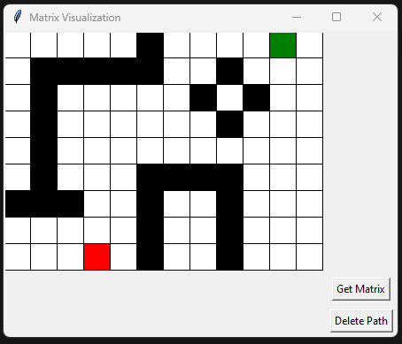
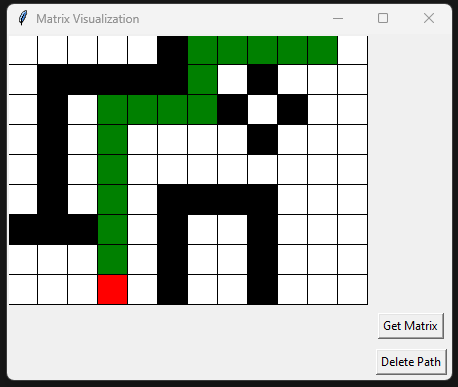

# BIM Pathfinding with Graph Algorithms

This repository contains code for a 2D Building Information Modeling (BIM) pathfinding tool using graph algorithms. 

The tool is implemented in Python and utilizes the tkinter library for the graphical user interface (GUI). 

The primary functionality includes creating and visualizing a matrix-based representation of a building layout, modifying the layout by designating specific colors to represent different elements, and finding the shortest path between a designated start and end point.

- 
- 


## Features

### MatrixGUI Class

The `MatrixGUI` class provides the main interface for interacting with the BIM tool. Key features include:

- **Graphical Representation:** The building layout is displayed as a matrix of colored squares on a canvas.
- **Color-Coded Elements:** Different colors represent distinct elements within the building (e.g., walls, paths, start, and end points).
- **User Interaction:** Users can click on squares to modify their color, allowing for easy editing of the building layout.
- **Get Matrix Button:** Retrieves the matrix representation of the building, incorporating any user modifications.
- **Delete Path Button:** Clears the pathfinding results by removing any designated paths in the matrix.
- **Start and End Points:** Red and green squares are used to mark the start and end points for pathfinding.

### Graph Class

The `Graph` class implements a basic graph data structure with functionalities for adding nodes, edges, and finding the shortest path using Dijkstra's algorithm. This class is utilized in the pathfinding process.

### Pathfinding Algorithm

The pathfinding algorithm is based on Dijkstra's algorithm, implemented in the `Graph` class. It calculates the shortest path between the designated start and end points on the matrix.

### Image Conversion Functions

Utility functions are provided to convert between the matrix representation and image files. The `matrix_to_bmp` function converts a matrix to a .bmp image, and `rgb_image_to_list` converts an image file back to a categorized pixel list.


1. Clone the repository:

```bash
git clone https://github.com/devYaksha/BIM-Pathfinding
```

2. Install tkinter

```bash
pip install tk
```

3. Run the main

```bash
python3 ./src/main.py
```
The GUI window will open, allowing you to interact with the BIM pathfinding tool.

## Usage

1. **Matrix Editing:**
   - Click on squares in the canvas to change their color, representing different elements in the building.
   - White: Empty space
   - Black: Walls or obstacles
   - Red: Start point
   - Green: End point

2. **Get Matrix:**
   - The algorithm finds the shortest path between the red (start) and green (end) points on the matrix.

3. **Delete Path:**
   - Click the "Delete Path" button to clear any designated paths on the matrix.

4. **Image Conversion:**
   - Use the provided utility functions to convert between the matrix representation and image files. (Saved on `./images`)

## Contributors

- [Guilherme Santos](https://github.com/devYaksha)

