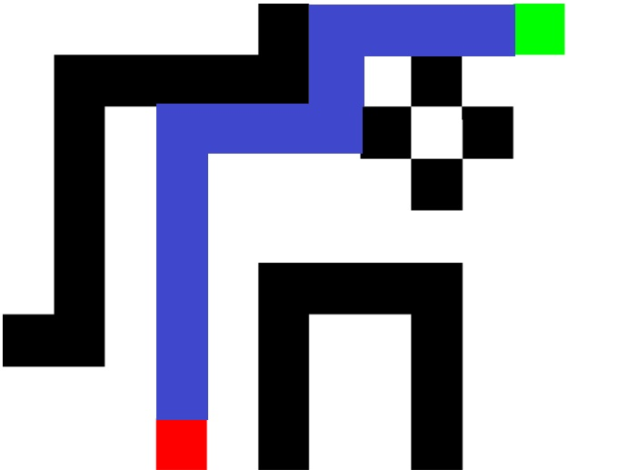

# Projeto BIM Pathfinding

## Descrição e Modelo Simplificado do Problema
Sistemas BIM (Building Information Modeling) são cada vez mais utilizados no planejamento de projetos de engenharia.

Este projeto aborda o conceito por trás desses sistemas, utilizando algoritmos e modelagem computacional para identificar potenciais problemas de acesso e movimentação de equipamentos em projetos BIM.

- O programa receberá como entrada uma imagem bitmap em preto e branco de uma projeção 2D do projeto BIM. 

- O ponto vermelho representa a posição atual do equipamento a ser deslocado, e a área em verde representa a área de destino para manutenção. O objetivo é transformar a imagem em um grafo, onde cada pixel é um nó e há arestas entre nós vizinhos no bitmap. O peso de todas as arestas é 1.

- Finalmente, o algoritmo de busca em largura será aplicado para identificar um possível caminho entre o equipamento e a área de manutenção.

### Exemplo 

